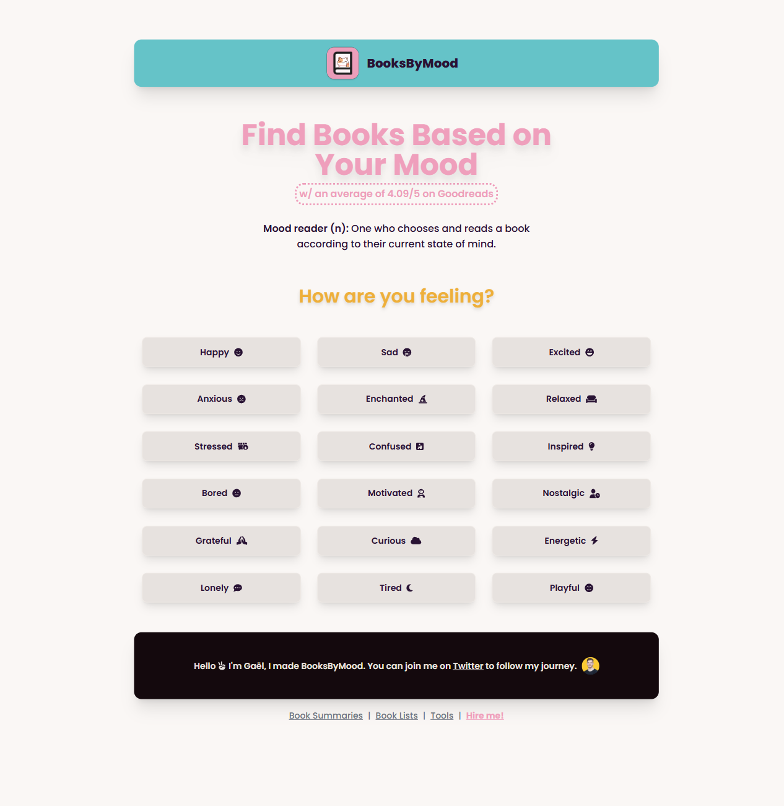

# Mood Book Recs

Mood Book Recs is a Python application that recommends books tailored to your current mood. It scrapes book data from booksbymood.com, sorts recommendations by rating, and helps you build a personalized reading list. The project uses Playwright for browser automation, SQLite for persistence, and includes a mood quiz to personalize your experience.

---

## Features

- **Mood-Based Quiz:** Answer a series of questions to determine your mood and receive book recommendations that match.
- **Web Scraping:** Automatically scrapes top-rated books for your mood from booksbymood.com.
- **Smart Recommendations:** Presents the three highest-rated books for your selected mood.
- **Reading & Recommended Lists:** Build, view, and manage your own reading list. Tracks which books you've already seen.
- **Persistent Storage:** Uses SQLite to save your reading and recommendation history.
- **CLI Interface:** Simple terminal-based interaction.
- **Testing:** Includes unit tests for quiz logic and data handling.

## Installation

### 1. Clone the Repository

```bash
git clone https://github.com/Mbshepp/mood-book-recs.git
cd mood-book-recs
```

### 2. Set Up Virtual Environment (Optional but recommended)

```bash
python -m venv venv
source venv/bin/activate  # On Windows: venv\Scripts\activate
```

### 3. Install Dependencies

```bash
pip install -r requirements.txt
```
*Make sure you have [Playwright](https://playwright.dev/python/docs/intro) installed and set up browsers:*
```bash
playwright install
```

### 4. Database Setup

No manual setup needed! The database and tables are initialized automatically on first run using the schema in `schema.sql`.

## Usage

Run the application from your terminal:

```bash
python app.py
```

You’ll be presented with a menu:
1. Take the Mood Quiz
2. View Reading List
3. View Recommended List
4. Exit

- **Take the Mood Quiz:** Answer 9 questions; your mood is determined and top books are recommended.
- **View Reading List:** See and manage books you've saved.
- **View Recommended List:** See all books the app has recommended to you.

## Project Structure

```
mood-book-recs/
│
├── app.py               # Main CLI application logic
├── database.py          # Database setup and helper functions
├── quiz_logic.py        # Mood quiz and answer code logic
├── schema.sql           # SQL schema for tables
├── test_app.py          # Unit tests for core logic
├── requirements.txt     # Python dependencies
├── .gitignore           # Ignore .db files and other unnecessary files
└── README.md            # This file
```

## Dependencies

- Python 3.8+
- [Requests](https://pypi.org/project/requests/)
- [Playwright](https://playwright.dev/python/)
- [SQLite3](https://docs.python.org/3/library/sqlite3.html)

## Testing

Run unit tests using pytest or your preferred test runner:

```bash
pytest test_app.py
```

## Screenshots



## Contributing

Pull requests are welcome! Please open an issue or discussion first if you’d like to make major changes.

- Fork the repo
- Create a feature branch
- Commit your changes
- Open a pull request

## License

Specify your license here (e.g. MIT, Apache-2.0, etc).

---

